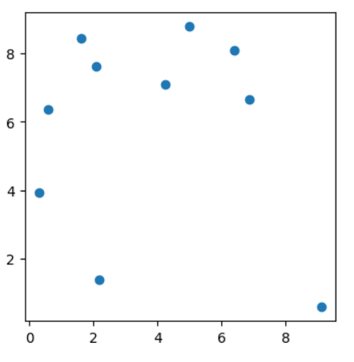
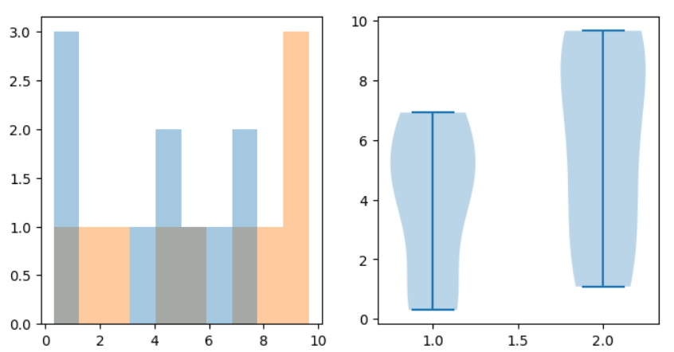

# Tutorial
Special thanks to Jingtian Zhou who wrote the original version of this homework. This tutorial is written to explain methods for solving the adapted version for the 2022 course.

## Preparation
To complete this homework, using Python, R, or Matlab is viable in analysis of the provided datasets, so feel free to use any of these. However, this tutorial will focus on using python to address the questions, specifically using Jupyter Notebooks for coding. 

Below are links which can be used in order to install python and jupyter notebooks if you have not already used them:
https://wiki.python.org/moin/BeginnersGuide/Download
https://jupyter.org/install

When using jupyter notebooks, you can launch them from the command line. Lauching them from the folder in which your datasets are stored (they can also be stored in a sub-folder) is likely easiest for navigation.

## Question 3
This problem involves performing statistical tests on the datasets given, comparing the two columns of each dataset as the two groups for each statistical test.
In order to begin, accessing the information in the files can be done in several ways, but one common method is using PANDAS:

```python
import pandas as pd
dataset1 = pd.read_csv("Q3/dataset1.txt", sep='\t', header=None)
```
This will put the data into a pandas dataframe object, which can be accesssed as follows:

```python
dataset1.iloc[:,0] #this will give the 0th column of the dataframe
dataset1.iloc[0] #this will give the 0th row of the dataframe
```
Use these functions and others to explore the data as you complete this problem. I encourage you to look at the documentation for pandas, specifically pd.read_csv to see what each argument is signifying in this specific example. The .iloc function allows access to the dataframe for slicing the data into columns for the purpose of the statstical testing here.

Now we can import the functions for statistical tests and use them:
```python
import scipy

scipy.stats.wilcoxon
scipy.stats.ttest_1samp
scipy.stats.rank_sum
scipy.stats.ttest_ind
```
Each of these tests will correspond to what is being asked of you in parts A and B of questions 3, so read the questions carefully in order to determine which to use.
Look up these functions in order to read the documentation of how to call them and what values they return, but an example may resemble:

```python
scipy.stats.wilcoxon(dataset1.iloc[:,0], dataset1.iloc[:,1])
```
The remember from above that dataset1.iloc[:,0] will give a slice of the 0th column to input into the function, this will be usefull in each of these statistical test funcitons. The other functions may have slightly different parameters, so be sure to look at them in order to determine exactly how they are used. 

The final element of question 3 involves plotting the data. Using matplotlib in python is the most effective way to plot the data in order to visualizes the data. There are many tutorial online giving examples, but here is an example of what plotting may look like:

```python
import numpy as np
import matplotlib.pyplot as plt
import scipy

data1 = 10*np.random.random_sample((10,2)) #generated random data for this example

result = scipy.stats.wilcoxon(data1[:,0], data1[:,1])

fig, ax = plt.subplots(1,1,figsize=(4,4))
ax.scatter(data1[:,0], data1[:,1])
```




This image represents the scattered data from the randomly generated being used as an example. If you were to run this exact example on your end you would get different random points on the scatterplot due to the data generation.

When comparing the levels of expression in the datasets for this problem, you may want to add axis titles, a chart title, or a line to the plot to represent equal expression. Some useful functions for this are listed below:

```python
ax.set_xlabel() #sets xaxis title
ax.set_ylabel() #sets yaxis title
ax.set_title() #sets chart title  
ax.plot() #can plot a line on an chart
```

You can experiment with these and look them up in order to make you charts for this assignment and future use more visually appealing and informative.

Finally, you can use plots other than scatterplot to visualize the data. Here is an example of how to make a histogram or violin plot (again using random data).

```python
fig, axes = plt.subplots(1,2,figsize=(8,4))
hist = axes[0].hist(data1, bins=10,alpha=.4, histtype="stepfilled")
axes[1].violinplot(data1)
```


