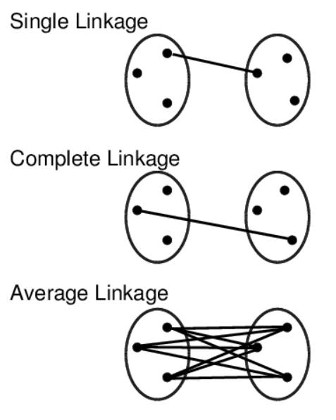

# BENG 183 HW5 Tutorial
Special thanks to Jingtian Zhou who wrote the original version of this homework in 2020. This tutorial is written to explain methods for solving the adapted version for the 2022 course.

## Preparation

Similar to HW4, this homework can be completed in a variety of programming languages such as R or Matlab, however this tutorial will focus on Python. See the links for installing python and jupyter from the HW4 tutorial, which can be found [here](HW4Tutorial.md).

## Question 2

For this problem we have datasets representing a collection of points (each row of the file being an x and y coordinate). We want to use several clustering methodologies in order to cluster the points and then plot these clustered and labeled points. 

All of the following methods of clustering are discussed in the class slides ([website link](https://systemsbio.ucsd.edu/course/beng183fa22/)) but here is a brief overview of what they are accomplishing:

K-means clustering is an algorithm which begins with a certain number of clusters which points are to be assigned to. From here, a distance vector is assigned from each point to each cluster center, with the point being placed into the nearest cluster center. This is done for all points and then new centers are calculated, and points are reassigned with new distance vectors. This process continues until the clusters converge (i.e. they no longer change) or some maximum number of iterations is reached.

***INCLUDE IMAGE***

Hierarchical clustering involves calcuating the similarity between a profile (a point or cluster) and all other profiles. From here the two most similar profiles are combined to form a new profile. This new profile has its similarity to others recalculated and this process of combining profiles continues until all of the profiles are combined into one large cluster. This large cluster can be broekn apart into its smaller pieces to reveal a good cluster number for the dataset. 
There are several methods for calculating this similarity in hierarchical clustering: arithmetic mean (UPGAM), complete linkage, and single linkage.

