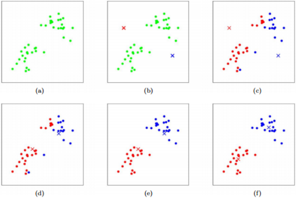
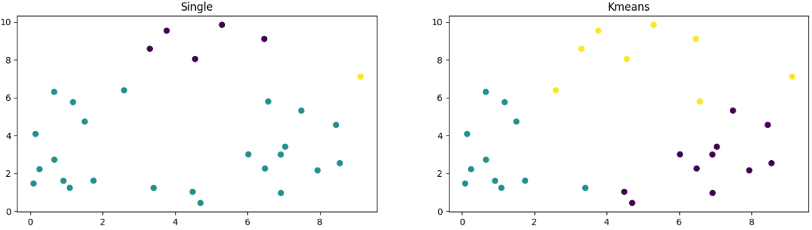

# BENG 183 HW5 Tutorial
Special thanks to Jingtian Zhou who wrote the original version of this homework in 2020. This tutorial is written to explain methods for solving the adapted version for the 2022 course.

## Preparation

Similar to HW4, this homework can be completed in a variety of programming languages such as R or Matlab, however this tutorial will focus on Python. See the links for installing python and jupyter from the HW4 tutorial, which can be found [here](HW4Tutorial.md).

## Question 2

For this problem we have datasets representing a collection of points (each row of the file being an x and y coordinate). We want to use several clustering methodologies in order to cluster the points and then plot these clustered and labeled points. 

All of the following methods of clustering are discussed in the class slides ([website link](https://systemsbio.ucsd.edu/course/beng183fa22/)) but here is a brief overview of what they are accomplishing:

K-means clustering is an algorithm which begins with a certain number of clusters which points are to be assigned to. From here, a distance vector is assigned from each point to each cluster center, with the point being placed into the nearest cluster center. This is done for all points and then new centers are calculated, and points are reassigned with new distance vectors. This process continues until the clusters converge (i.e. they no longer change) or some maximum number of iterations is reached.



Image from lecture slides


Hierarchical clustering involves calcuating the similarity between a profile (a point or cluster) and all other profiles. From here the two most similar profiles are combined to form a new profile. This new profile has its similarity to others recalculated and this process of combining profiles continues until all of the profiles are combined into one large cluster. This large cluster can be broekn apart into its smaller pieces to reveal a good cluster number for the dataset. 
There are several methods for calculating this similarity in hierarchical clustering: arithmetic mean (UPGAM), complete linkage, and single linkage.


Image courtesy of https://girke.bioinformatics.ucr.edu/GEN242/tutorials/rclustering/rclustering/


From here we can begin to implement these clustering algorithms. For this assignment our data will consist of 2 columns of x and y coordinates which will be used to calculate the distance as described in the above methodolgies. For this tutorial random data will be used to illustrate whcih functions to call and how:

```python
import numpy as np
import matplotlib.pyplot as plt
from sklearn.cluster import KMeans
from scipy.cluster.hierarchy import fcluster, linkage

data1 = 10*np.random.random_sample((30,2)) #Random sample of data for this example only

fig, axes = plt.subplots(1,2,figsize=(16,4)) #making a plot with 2 subplots

#linkage function and fccluster are scipy.cluster.hierarchy functions
links = linkage(data1, method="single")
axes[0].scatter(data1[:,0], data1[:,1], c=fcluster(links,t=3,criterion="maxclust"))
axes[0].set_title("Single")

# kmeans is a scipy.cluster function
kmeans = KMeans(n_clusters=3,n_init=100,random_state=0).fit(data1)
axes[1].scatter(data1[:,0], data1[:,1], c=kmeans.predict(data1))
axes[1].set_title("Kmeans")
```


Above we can see the resulting plot from our analysis, in this case displaying first the single linkage plot and then the kmeans plot for clustering.
